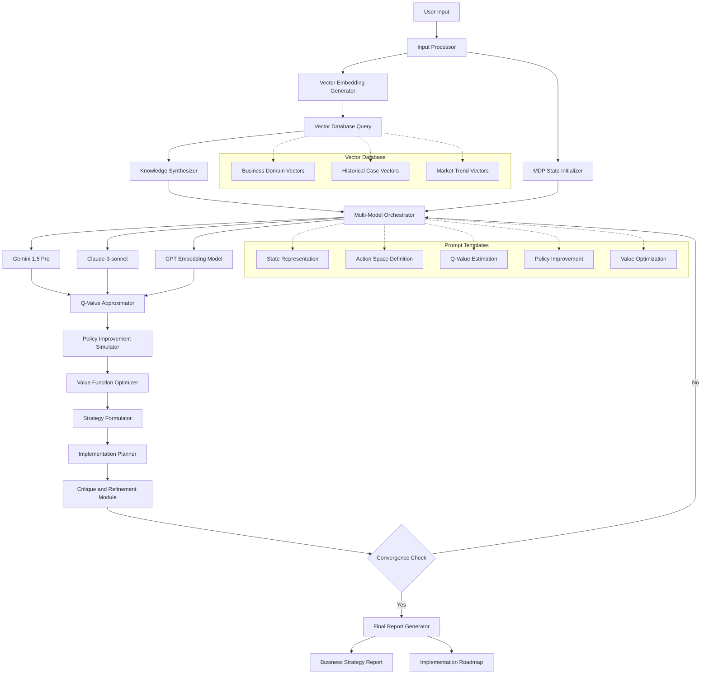

# 🚀 CEO-PRO

<div align="center">


[](https://semver.org)
[](https://opensource.org/licenses/MIT)
[](https://www.python.org/downloads/)

*Advanced Multi-Model Business Strategy Optimizer - Revolutionizing business strategy with cutting-edge AI*

[Features](#-key-features) • [Installation](#-installation) • [Usage](#-usage) • [Architecture](#-system-architecture) • [Contributing](#-contributing) • [License](#-license)

</div>

## 🌟 Project Overview

The Advanced Multi-Model Business Strategy Optimizer is a groundbreaking AI system that harnesses the power of Markov Decision Processes (MDPs), multiple large language models (LLMs) and a comprehensive vector database to generate, evaluate, and refine complex business strategies. This project represents a leap in AI-assisted business consulting, offering unparalleled reasoning improvements and strategic depth compared to prompting with foundation models.

### 🧠 Theoretical Foundation

At its core, our system is built on the mathematical framework of Markov Decision Processes (MDPs), formulated as:

$$(S, A, P, R, \gamma)$$

Where:
- $S$: State space of business scenarios
- $A$: Action space of strategic decisions
- $P: S \times A \times S \rightarrow [0, 1]$: Transition function
- $R: S \times A \rightarrow \mathbb{R}$: Reward function
- $\gamma \in [0, 1]$: Discount factor

Our innovative approach approximates value functions through advanced prompt engineering:

$$V(s) \approx \mathbb{E}_\pi[R(s, a) + \gamma V(s')]$$

## 🔑 Key Features

- 🤖 **Multi-Model AI Ensemble**: Synergistic use of Gemini, Claude, and GPT
- 🔍 **High-Dimensional Vector Database**: 3072-dimensional space for nuanced knowledge representation
- 🧮 **Advanced Prompt Engineering**: Simulating value-based learning with LLMs
- 📊 **Dynamic Strategy Formulation**: Iterative optimization and refinement
- ⚡ **Computational Efficiency**: Reduced complexity from $O(|S|^2 |A|)$ to $O(k \cdot m)$

## 🛠 Installation

```bash
# Clone the repository
git clone https://github.com/yourusername/business-strategy-optimizer.git
cd business-strategy-optimizer

# Install dependencies
pip install -r requirements.txt

# Set up environment variables
cp .env.example .env
# Edit .env with your API keys
```

## 🖥 Usage

1. Open `business_consulting_chatbot.py`
2. Modify the `HARDCODED_QUERY` variable:
   ```python
   HARDCODED_QUERY = """
   [Your detailed business scenario here]
   """
   ```
3. Run the script:
   ```bash
   python business_consulting_chatbot.py
   ```

## 🏗 System Architecture

<div align="center">



</div>

## 📊 Output

The system generates two key documents:

1. **Comprehensive Business Plan** (`Final_Business_Report.md`)
2. **Detailed Implementation Plan** (`Final_Implementation_Plan.md`)

## 🧪 Testing

Run the test suite with:

```bash
python -m unittest discover tests
```

## 🤝 Contributing

We welcome contributions! Please see our [Contributing Guidelines](CONTRIBUTING.md) for details.

## 📜 License

This project is licensed under the MIT License - see the [LICENSE](LICENSE) file for details.

## 🙏 Acknowledgements

- OpenAI for GPT models
- Google for Gemini 1.5 Pro
- Anthropic for Claude-3-sonnet


## 🔗 Related Projects

- [OpenAI Gym](https://github.com/openai/gym)
- [Hugging Face Transformers](https://github.com/huggingface/transformers)

## 📞 Contact

For queries, please open an issue or contact [your.email@example.com](mailto:your.email@example.com).

---

<div align="center">

📈 Empowering businesses with AI-driven strategies 🌍

[Top](#-advanced-multi-model-business-strategy-optimizer)

</div>
