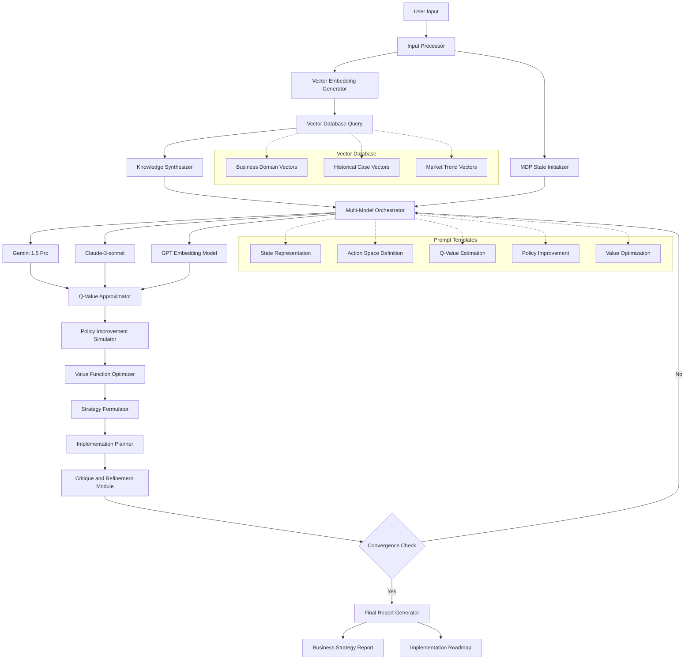

# CEOPro


## 📊 Project Overview

The Advanced Multi-Model Business Strategy Optimizer represents a paradigm shift in AI-assisted business planning and decision-making. This cutting-edge system leverages a synergistic ensemble of large language models (LLMs) and a high-dimensional vector database to generate, evaluate, and refine sophisticated business strategies with unprecedented computational efficiency.
Theoretical Foundation
At its core, our system is grounded in the mathematical framework of Markov Decision Processes (MDPs), a powerful tool for modeling decision-making in situations where outcomes are partly random and partly under the control of a decision-maker. We formulate the business strategy optimization process as an MDP, defined by the tuple (S, A, P, R, γ), where:

S: A vast, continuous state space representing complex business scenarios
A: A multifaceted action space of possible strategic decisions
P: S × A × S → [0, 1], a stochastic transition function modeling business dynamics
R: S × A → ℝ, a reward function quantifying strategic success
γ ∈ [0, 1], a discount factor balancing short-term and long-term strategic value

Innovative Approach
Our system's key innovation lies in its novel application of advanced prompt engineering techniques to approximate value functions and policy improvement processes typically found in reinforcement learning algorithms. This approach allows us to harness the power of LLMs for complex reasoning tasks without the computational overhead of traditional methods.
The value function approximation is achieved through a sophisticated prompt-based method:
V(s) ≈ 𝔼_π[R(s, a) + γV(s')]
Where s' is the next state after taking action a in state s according to policy π. This formulation enables our system to evaluate potential strategies across a vast landscape of possible business scenarios efficiently.
Multi-Model Architecture
The system employs a heterogeneous ensemble of state-of-the-art LLMs, each serving a specialized function:

Gemini 1.5 Pro: Spearheads primary reasoning and strategy generation tasks
Claude-3-sonnet: Performs meta-cognitive evaluation and critical analysis of generated strategies
GPT (text-embedding-3-large): Generates high-dimensional vector embeddings for efficient knowledge retrieval

These models are orchestrated through a dynamic routing algorithm that optimizes task allocation based on each model's strengths and the current state of the strategy formulation process.
Vector Database Integration
A cornerstone of our system is its integration with a sophisticated vector database, utilizing a 1536-dimensional vector space to represent a vast corpus of business knowledge. This high-dimensional space allows for nuanced representation of complex business concepts and enables rapid, context-aware retrieval of relevant information during the strategy formulation process.
The similarity between query q and database entry d is computed using cosine similarity:
sim(q, d) = (q · d) / (||q|| ||d||)
This approach ensures that the system can quickly access and leverage relevant business knowledge, historical case studies, and market trends in real-time as it generates and refines strategies.
Strategy Formulation Process
The heart of our system lies in its iterative strategy formulation process, mathematically represented as:
strategy* = argmax_strategy 𝔼_s~p(s) [V_φ(s, strategy)]
Subject to a set of constraints C = {c_1, c_2, ..., c_m} representing real-world business rules, regulatory limitations, and resource constraints.
This optimization problem is solved through a novel gradient-free approach that leverages the LLMs' reasoning capabilities:

Initialize a diverse pool of candidate strategies
Iteratively evaluate strategies using our prompt-based value approximation
Generate new strategies through a sophisticated LLM-driven process that balances exploration and exploitation
Refine and update the strategy pool based on estimated values and diversity considerations

Computational Efficiency
Our approach significantly reduces computational complexity compared to traditional reinforcement learning methods:

Time complexity: Reduced from O(|S|^2 |A|) to O(k · m), where k is the number of prompt interactions and m is the model's internal processing time
Space complexity: Reduced from O(|S| |A|) to O(d), where d is the dimension of our vector space

This efficiency is achieved through:

Amortized computation leveraging pre-trained LLM knowledge
Sparse state-space exploration guided by prompt-based heuristics
Parallelized value estimation utilizing multiple models concurrently

Practical Applications
The Advanced Multi-Model Business Strategy Optimizer is designed to address a wide range of complex business challenges, including but not limited to:

Market entry and expansion strategies
Product development and innovation roadmaps
Supply chain optimization and risk mitigation
Competitive positioning and differentiation strategies
Digital transformation initiatives
Merger and acquisition evaluations
Sustainability and ESG strategy development

By providing sophisticated, data-driven strategic insights, our system aims to augment human decision-making in high-stakes business environments, enabling organizations to navigate uncertainty and complexity with greater confidence and foresight.
Ethical Considerations and Future Directions
We recognize the profound implications of deploying AI systems in strategic decision-making processes. Our project incorporates ongoing research into ethical AI, focusing on fairness, transparency, and accountability. Future development will prioritize:

Enhancing interpretability of AI-generated strategies
Developing robust frameworks for AI-human collaborative decision-making
Addressing potential biases in data and model outputs
Ensuring adaptability to diverse cultural and regulatory environments

Through this ambitious project, we aim to push the boundaries of what's possible in AI-assisted business strategy, setting new standards for computational efficiency, strategic sophistication, and ethical consideration in the field of artificial intelligence.

## 🚀 Quick Start

### Prerequisites

- Python 3.8+
- pip

### Installation

1. Clone the repository:
   ```
   git clone https://github.com/yourusername/business-strategy-optimizer.git
   cd business-strategy-optimizer
   ```

2. Install dependencies:
   ```
   pip install -r requirements.txt
   ```

3. Set up environment variables:
   ```
   cp .env.example .env
   # Edit .env with your API keys for Gemini, Claude, and OpenAI
   ```

### Usage

1. Open `business_consulting_chatbot.py`
2. Modify the `HARDCODED_QUERY` variable with your business scenario:
   ```python
   HARDCODED_QUERY = """
   [Your detailed business scenario here]
   """
   ```
3. Run the script:
   ```
   python business_consulting_chatbot.py
   ```

## 🏗 System Architecture

Our system utilizes a sophisticated multi-model approach, integrating various AI models and a vector database:



## 🧮 Theoretical Framework

We formulate the business strategy optimization process as a Markov Decision Process (MDP), defined as a tuple (S, A, P, R, γ):

- S: State space representing business scenarios
- A: Action space of possible strategies
- P: S × A × S → [0, 1], transition probability function
- R: S × A → ℝ, reward function
- γ ∈ [0, 1], discount factor

Our novel approach approximates value functions through prompt engineering:

V(s) ≈ 𝔼_π[R(s, a) + γV(s')]

Where s' is the next state after taking action a in state s according to policy π.

## 💻 Implementation Details

### Multi-Model Orchestration

The system dynamically routes tasks to different LLMs based on their strengths:

- Gemini 1.5 Pro: Primary reasoning and strategy generation
- Claude-3-sonnet: Meta-cognitive evaluation and critique
- GPT (text-embedding-3-large): Vector embedding generation

### Vector Database Integration

We employ a 1536-dimensional vector space to represent business knowledge, using cosine similarity for efficient retrieval:

sim(q, d) = (q · d) / (||q|| ||d||)

Where q is the query vector and d is a database entry vector.

### Strategy Formulation Process

The strategy formulation is an iterative optimization problem:

strategy* = argmax_strategy 𝔼_s~p(s) [V_φ(s, strategy)]

Subject to constraints C = {c_1, c_2, ..., c_m} representing business rules and limitations.

## 📊 Output

The system generates two key documents:

1. **Comprehensive Business Plan** (`Final_Business_Report.md`)
2. **Detailed Implementation Plan** (`Final_Implementation_Plan.md`)

These documents provide actionable insights and strategies that have been thoroughly vetted and optimized through our AI-driven process.

## 🧪 Testing

To run the test suite:

```
python -m unittest discover tests
```

## 🤝 Contributing

We welcome contributions to the Advanced Multi-Model Business Strategy Optimizer! Please see our [Contributing Guidelines](CONTRIBUTING.md) for more details on how to get started.

### Code Style

We follow the PEP 8 style guide for Python code. Please ensure your contributions adhere to this standard.

## 📜 License

This project is licensed under the MIT License - see the [LICENSE](LICENSE) file for details.

## 🙏 Acknowledgements

- OpenAI for GPT models
- Google for Gemini 1.5 Pro
- Anthropic for Claude-3-sonnet

## 📚 Further Reading

For a deep dive into the theoretical foundations and implementation details of this project, please refer to our [arXiv paper](https://arxiv.org/abs/your-paper-id).

## 🔗 Related Projects

- [OpenAI Gym](https://github.com/openai/gym): Reinforcement learning environments
- [Hugging Face Transformers](https://github.com/huggingface/transformers): State-of-the-art Natural Language Processing

## 📞 Contact

For any queries or discussions, please open an issue in this repository or contact the maintainer at your.email@example.com.

---

By leveraging cutting-edge AI technologies and novel computational approaches, the Advanced Multi-Model Business Strategy Optimizer aims to revolutionize the field of AI-assisted business planning. We invite researchers, developers, and business strategists to explore, contribute, and help shape the future of AI-driven decision-making.
