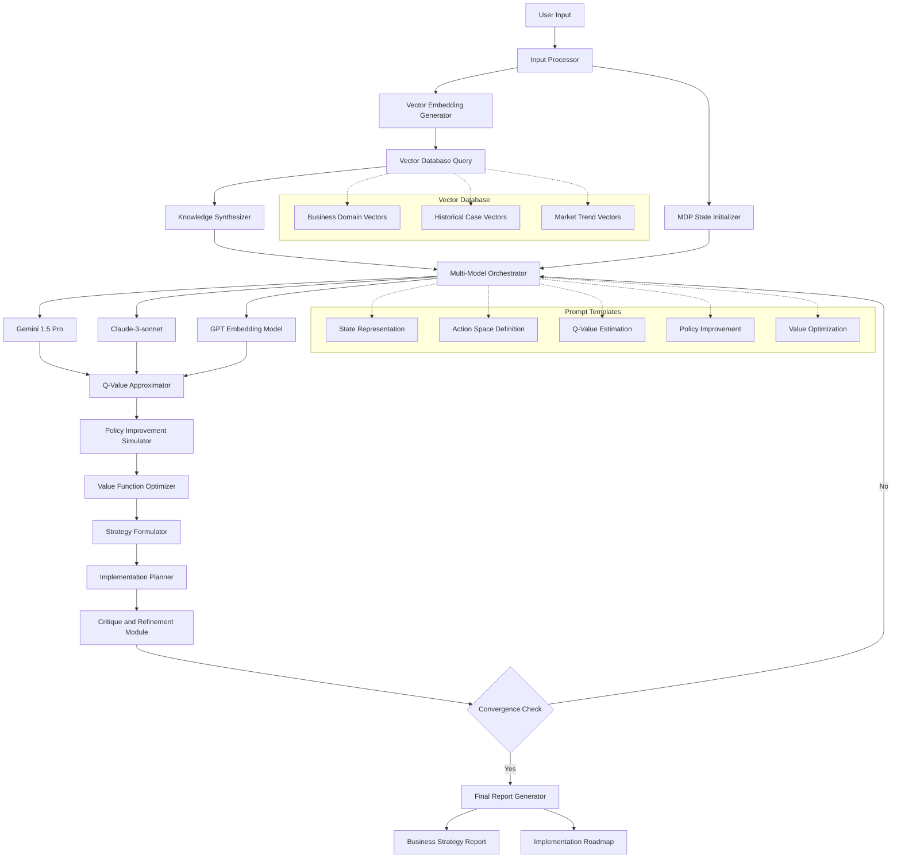

# CEOPro


## 📊 Project Overview

The Advanced Multi-Model Business Strategy Optimizer is a cutting-edge AI system that leverages multiple large language models (LLMs) and a comprehensive vector database to generate sophisticated business strategies. This project represents a significant advancement in AI-assisted business planning, offering a computationally efficient approach to complex decision-making processes.

### Key Features

- 🧠 Multi-model AI approach combining Gemini, Claude, and GPT
- 🔍 High-dimensional vector database for relevant information retrieval
- 🔮 Advanced prompt engineering for simulating value-based learning
- 📊 Dynamic strategy formulation and refinement
- 🛠 Computationally efficient alternative to traditional reinforcement learning methods

## 🚀 Quick Start

### Prerequisites

- Python 3.8+
- pip

### Installation

1. Clone the repository:
   ```
   git clone https://github.com/yourusername/business-strategy-optimizer.git
   cd business-strategy-optimizer
   ```

2. Install dependencies:
   ```
   pip install -r requirements.txt
   ```

3. Set up environment variables:
   ```
   cp .env.example .env
   # Edit .env with your API keys for Gemini, Claude, and OpenAI
   ```

### Usage

1. Open `business_consulting_chatbot.py`
2. Modify the `HARDCODED_QUERY` variable with your business scenario:
   ```python
   HARDCODED_QUERY = """
   [Your detailed business scenario here]
   """
   ```
3. Run the script:
   ```
   python business_consulting_chatbot.py
   ```

## 🏗 System Architecture

Our system utilizes a sophisticated multi-model approach, integrating various AI models and a vector database:



## 🧮 Theoretical Framework

We formulate the business strategy optimization process as a Markov Decision Process (MDP), defined as a tuple (S, A, P, R, γ):

- S: State space representing business scenarios
- A: Action space of possible strategies
- P: S × A × S → [0, 1], transition probability function
- R: S × A → ℝ, reward function
- γ ∈ [0, 1], discount factor

Our novel approach approximates value functions through prompt engineering:

V(s) ≈ 𝔼_π[R(s, a) + γV(s')]

Where s' is the next state after taking action a in state s according to policy π.

## 💻 Implementation Details

### Multi-Model Orchestration

The system dynamically routes tasks to different LLMs based on their strengths:

- Gemini 1.5 Pro: Primary reasoning and strategy generation
- Claude-3-sonnet: Meta-cognitive evaluation and critique
- GPT (text-embedding-3-large): Vector embedding generation

### Vector Database Integration

We employ a 1536-dimensional vector space to represent business knowledge, using cosine similarity for efficient retrieval:

sim(q, d) = (q · d) / (||q|| ||d||)

Where q is the query vector and d is a database entry vector.

### Strategy Formulation Process

The strategy formulation is an iterative optimization problem:

strategy* = argmax_strategy 𝔼_s~p(s) [V_φ(s, strategy)]

Subject to constraints C = {c_1, c_2, ..., c_m} representing business rules and limitations.

## 📊 Output

The system generates two key documents:

1. **Comprehensive Business Plan** (`Final_Business_Report.md`)
2. **Detailed Implementation Plan** (`Final_Implementation_Plan.md`)

These documents provide actionable insights and strategies that have been thoroughly vetted and optimized through our AI-driven process.

## 🧪 Testing

To run the test suite:

```
python -m unittest discover tests
```

## 🤝 Contributing

We welcome contributions to the Advanced Multi-Model Business Strategy Optimizer! Please see our [Contributing Guidelines](CONTRIBUTING.md) for more details on how to get started.

### Code Style

We follow the PEP 8 style guide for Python code. Please ensure your contributions adhere to this standard.

## 📜 License

This project is licensed under the MIT License - see the [LICENSE](LICENSE) file for details.

## 🙏 Acknowledgements

- OpenAI for GPT models
- Google for Gemini 1.5 Pro
- Anthropic for Claude-3-sonnet

## 📚 Further Reading

For a deep dive into the theoretical foundations and implementation details of this project, please refer to our [arXiv paper](https://arxiv.org/abs/your-paper-id).

## 🔗 Related Projects

- [OpenAI Gym](https://github.com/openai/gym): Reinforcement learning environments
- [Hugging Face Transformers](https://github.com/huggingface/transformers): State-of-the-art Natural Language Processing

## 📞 Contact

For any queries or discussions, please open an issue in this repository or contact the maintainer at your.email@example.com.

---

By leveraging cutting-edge AI technologies and novel computational approaches, the Advanced Multi-Model Business Strategy Optimizer aims to revolutionize the field of AI-assisted business planning. We invite researchers, developers, and business strategists to explore, contribute, and help shape the future of AI-driven decision-making.
